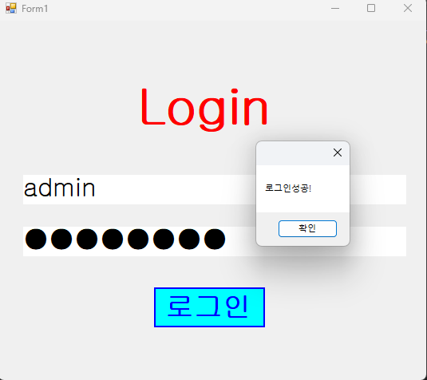
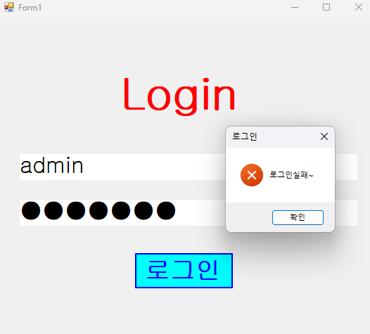

# (C# 코딩) 로그인스크린

## 개요
-C# 프로그래밍학습

-1줄소개: 아이디와 패스워드 입력을 받아 로그인을 하는 창

-사용한플랫폼: 
    -C#, .NET Windows Forms, Visual Studio, GitHub

-사용한컨트롤:
    - Label, TextBox, Button

-사용한기술과구현한기능: 
    - string 변수로 ID와 PW를 각 설정
    - if-else문으로 ID와 PW 모두 일치할 때 로그인 / 그렇지않으면 로그인 실패
    - UseSystemPasswordChar로 PW는 *처리하여 비번을 가림
    - KeyDown 이벤트에서 Enter 입력을 받으면 ID->PW, PW->버튼클릭 실행

## 실행화면(과제1)

-과제1 코드의 실행 스크린샷

-과제 내용
    - 로그인과 비번 변수를 설정하여 로그인/로그인 실패 창을 생성함. Enter로 키를 넘기고 btn을 실행하는 등의 편의 기능까지 구현함.

-구현 내용과 기능 설명
    - string 변수로 ID와 PW를 각 설정
    - if-else문으로 ID와 PW 모두 일치할 때 로그인 / 그렇지않으면 로그인 실패
    - UseSystemPasswordChar로 PW는 *처리하여 비번을 가림
    - KeyDown 이벤트에서 Enter 입력을 받으면 ID->PW, PW->버튼클릭 실행
